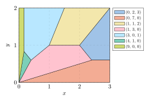
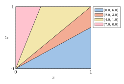
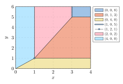

# mosaic

Create diagrams to visualize cost landscapes for Pareto combinatorial optimization, in the style of Libeskind-Hadas' [costscape](https://www.cs.hmc.edu/xscape/) diagrams.

## Setting

Consider the general combinatorial optimization problem where the linear function $c^\top v$ is to be minimized,
where $v \in S \subseteq \mathbb{R}_{\ge0}^n$ is a vector of variables in the solution space $S$
and $c \in \mathbb{R}_{\ge0}^n$ is a vector of parameters (costs).

> _For example, in the [sequence alignment (or string edition)](https://en.wikipedia.org/wiki/Edit_distance) problem, we may have $n = 3$ dimensions representing the number of insertion, deletion or substitution operations. Then, $S$ would represent the vectors counting the number of operations of each type for each valid alignment, and $c$ would indicate the relative costs given to each operation type._

In situations where there is no clear choice for the costs $c$, one can instead perform _multi-objective_ optimization, minimizing $v$ over all dimensions at the same time.
More precisely, one may be interested in the set of [Pareto-optimal vectors](https://en.wikipedia.org/wiki/Pareto_front), i.e., all vectors $v_0 \in S$ such that there exists a set of parameters $c_0$ that make $c_0^\top v_0$ optimal with respect to the other elements of $S$.

Given such a set $S_0 \subseteq S$ of Pareto-optimal vectors, it may be insightful to visualize exactly which values of $c$ make the various vectors optimal.
This module can be used to create such diagrams of cost landscapes.

## Examples

## Usage

### Installing

This module requires the numpy, scipy and [pypoman](https://github.com/stephane-caron/pypoman) modules which are available on PyPI.
The latter module requires the [CDD](https://github.com/cddlib/cddlib), [GLPK](https://www.gnu.org/software/glpk/) and [GMP](https://gmplib.org/) system libraries to be installed.

### `mosaic.find_regions(vectors, slice_last=True)`

Compute the cost regions of optimality for a set of Pareto-optimal vectors.

- _Input:_ `vectors` is the list of Pareto-optimal vectors.
  All vectors should have the same dimension (they may be passed as rows of a _numpy_ array).
  By default, the last cost dimension is constrained to equal 1, hence if all vectors have dimension $n$ then the dimension of the region vertices will be $n-1$.
  This behavior can be disabled by passing `slice_last=False`.
- _Output:_ Returns two dictionaries, the first associating each cost region to the set of optimal vectors in that region, the second associating each region to its Chebyshev center.
  Regions are convex polyhedra represented as the sets of their vertices.

Note that setting `slice_last=True` may exclude some regions that do not intersect the hyperplane with last coordinate equal to one.
When setting it to `False`, one will observe that all regions meet at the origin, as a consequence of the cost linearity.

### `mosaic.plot_regions_cetz(regions, centers)`

Generate a Typst document containing a [CeTZ plot](https://github.com/cetz-package/cetz-plot/) visualizing the regions computed by `find_regions`.
For this function to work, the regions must be two-dimensional.

### `mosaic.plot_regions_pgfplots(regions, centers, colors=base_palette)`

Generate a LaTeX document containing a [pgfplots](https://ctan.org/pkg/pgfplots) plot visualizing the regions computed by `find_regions`.
The default color palette is [Paul Tol’s 8-colors light quantitative palette](https://web.archive.org/web/20250224202317/https://personal.sron.nl/~pault/#fig:scheme_light).
They can be changed through the `colors` argument.
For this function to work, the regions must be two-dimensional.

## References

- R. Libeskind-Hadas, Y.-C. Wu, M. S. Bansal, and M. Kellis, _“Pareto-optimal phylogenetic tree reconciliation,”_ Bioinformatics, vol. 30, no. 12, pp. i87–i95, Jun. 2014, doi: [10.1093/bioinformatics/btu289](https://doi.org/10.1093/bioinformatics/btu289).

## License

This library is distributed under the GPL-3.0 license.
[See license text.](LICENSE)
